# MLSLabsRenderer-Lite

<a href="./LICENSE">
        </a>

English | [中文](./README_CN.md)

[

](https://github.com/mlslabs)


# Introduction

**MLSLabsRenderer-Lite** is a high-performance Unreal Engine 5 (UE5) plugin developed by [**MaLanShan Audio & Video Laboratory**](https://www.mlslabs.com.cn/). It is designed for real-time visualization, management, and scalable hybrid rendering of 3D Gaussian Splatting (3DGS) and dynamic Volumetric Video (4DGS).

Unlike traditional Niagara-based solutions, this plugin utilizes a **custom low-level rendering pipeline**. This allows it to maintain exceptionally high frame rates even when processing millions of Gaussians, effectively bypassing common performance bottlenecks.

Since we are at early access, current accessible features are summarized below:
- **High-Performance Static 3DGS**: Supports 7M+ Gaussians while maintaining 50+ FPS(tested on NVIDIA RTX 4070 Ti).
- **Dynamic 4DGS Playback**: Real-time volumetric video sequence playback supporting 100K+ Gaussians at 100+ FPS(tested on NVIDIA RTX 4070 Ti).
- **Sequencer Integration**: Full support for UE Sequencer, allowing keyframe control over volumetric playback.
- **Native Custom Engine**: Built from the ground up (Non-Niagara) for maximum throughput and low latency.
- **Production Workflow**: Seamless integration with native UE assets and rapid resource importing.

---
# Getting Started

## Video Tutorial

Youtube（English）：  


B站（中文）：  


## System Requirements

- **Operating System**: Windows 10 or 11 (64-bit)
- **Unreal Engine**: 5.5.x
- **Graphics API**: DirectX 12
- **GPU Requirements**: NVIDIA GPU supporting **Shader Model 7.5** or higher (Turing architecture and above).
- **Minimum Hardware**: NVIDIA GeForce **RTX 2060** or better.
- **Recommended Hardware**: NVIDIA GeForce **RTX 4070Ti** or better.


## Plugin download

  1. Open github Release page 

  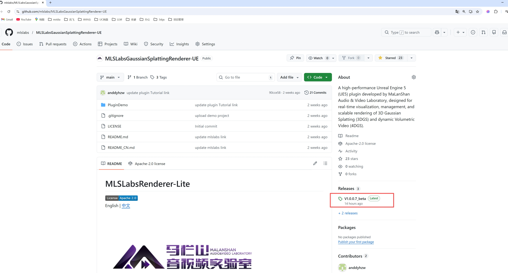

  2. Choose the latest version (currently v1.0.0.5_beta).
  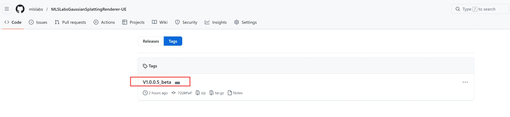
  
  3. Download the zip file.

  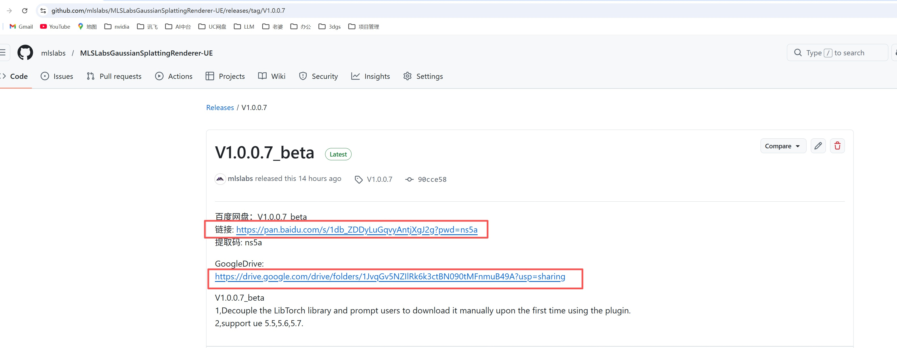

  4. Installation:
  To package your project, unzip MLSLabsRenderer-Lite_V1.0.0.5_beta_ue5.5.zip to your Engine Installation Path `Plugins\Marketplace`.

  
  
  Alternatively, unzip it directly into your project's `Plugins\` folder.
  
  
  
  5.Open Unreal Editor，enable the MLSLabsRenderer Plugin, and restart editor.

  

 ## Demo Data Download Links:

It is recommended to download .ply files from [SuperSplat](https://superspl.at/), which can then be imported into Unreal Engine (UE) via this plugin for real-time rendering.

## Open demo project
This repo contains a demo project with an example scene and level

0. download using git clone
```
git clone https://github.com/mlslabs/MLSLabsGaussianSplattingRenderer-UE.git
```

1. Open `PluginDemo.uproject` to start UE
2. Open `Maps/Test` level

## Import Static Gaussian Splatting Models

1.Click on the 'Import single 3D Gaussian Splatting file' button on the navigation bar.


2.Select your 'ply' file.

Special thanks to saemranian for providing the test data:[Ahmad_Apt_Mix_01](https://superspl.at/view?id=f32cc087) .

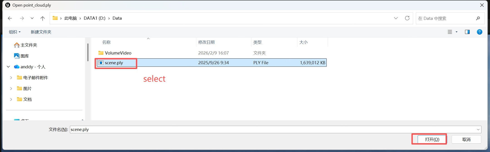

3.After importing, drag the Blueprint (BP) asset into the viewport.


4.The scene will render. You can adjust its position using the Move, Rotate, and Scale gizmos.
'Note': The "Splat Data Path" uses an absolute path. If you move the project or clone it to a new machine, ensure you update the path to point to your local .ply file.

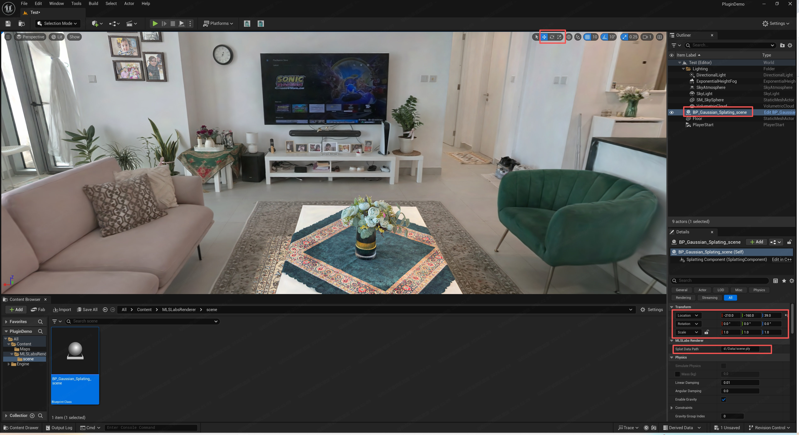


## Import Animated Gaussian Splatting (4DGS/Volumetric Video)

1.Click the 'Import multiple 3D Gaussian Splatting files' button on the navigation bar.
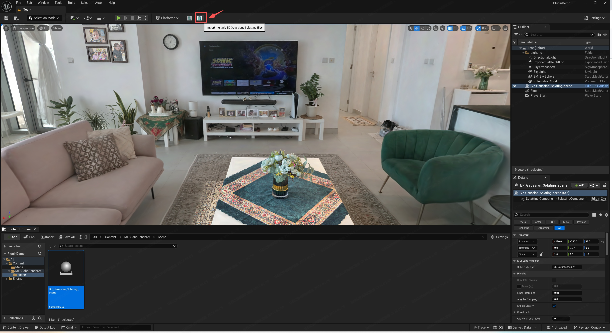

2.Select the .ply files. (You do not need to select all files; selecting two or more files will load the entire sequence in that directory).

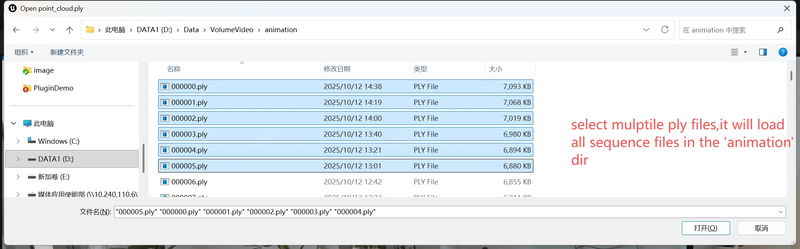

3.Drag the animation BP asset into the viewport.

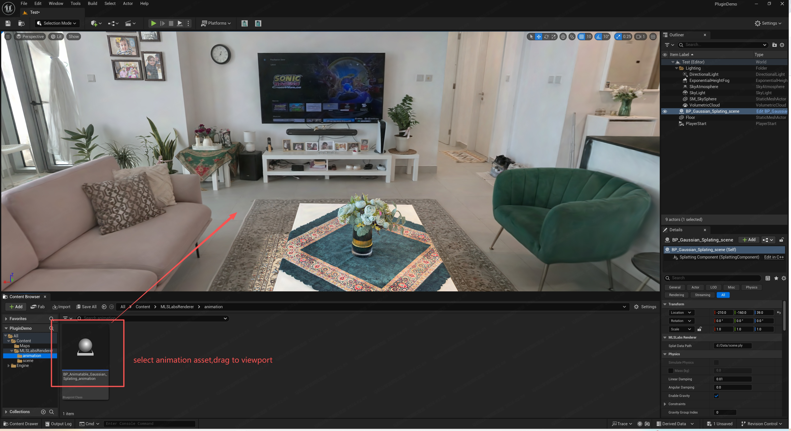

4.The first frame will render. 'Frame Count' indicates the total number of frames loaded.

You can adjust its position using the Move, Rotate, and Scale gizmos.
'Note': The "Splat Data Path" uses an absolute path. If you move the project or clone it to a new machine, ensure you update the path to point to your local .ply file's directory.

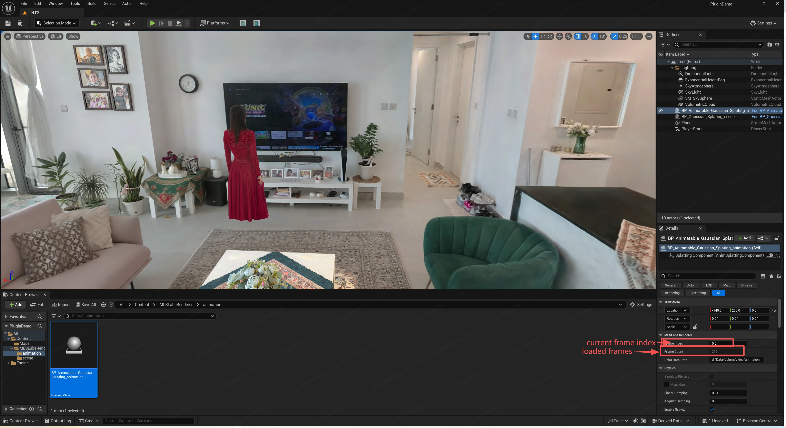

5.You can press the 'F' key to focus on the Gaussian Splatting Actor when it is selected.

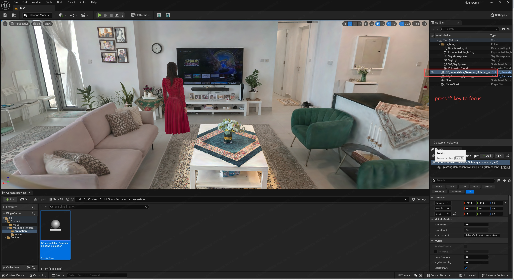

6.To enable playback:
Click the 'Add' button in the Details panel.
Search for and add the 'Volume Actor' component.

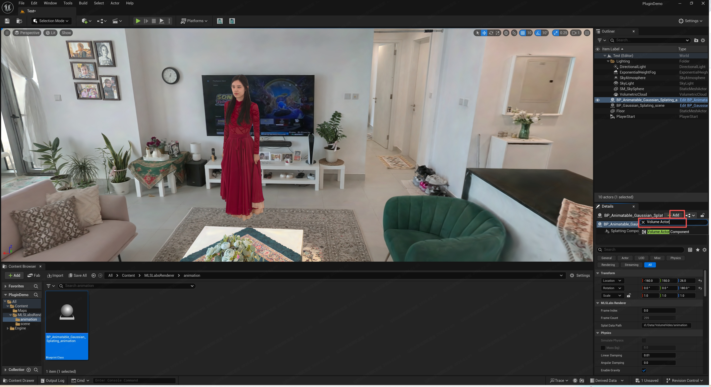

Click the 'Play' (Run) button on the top navigation bar.

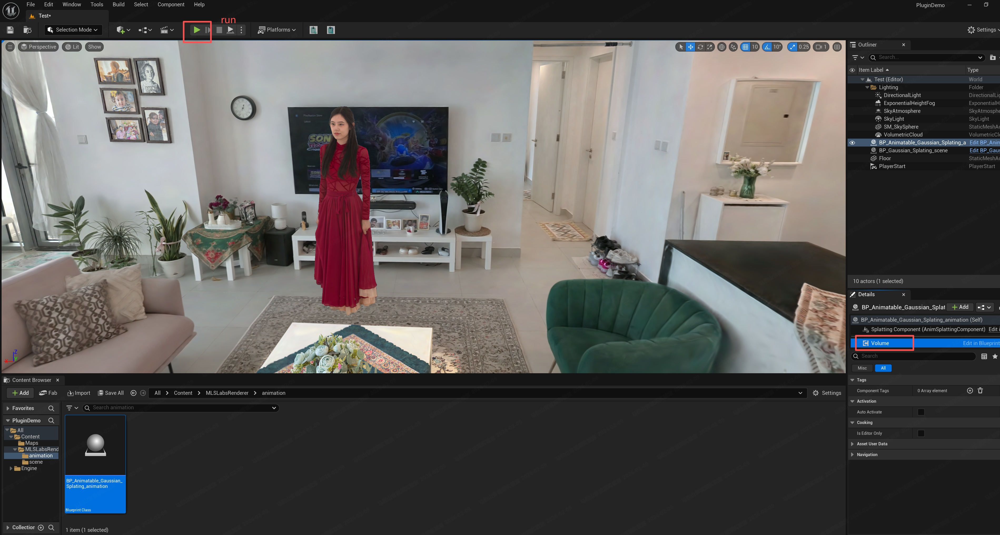

the Volume video(4DGS) will be played.

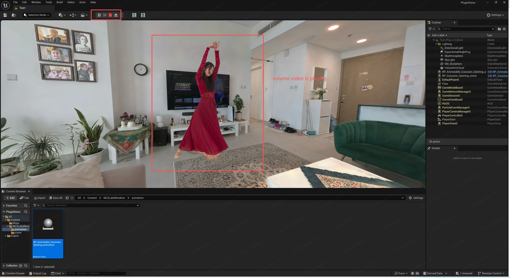

## Keyframe Control via UE Sequencer

1.Create Level Sequence.

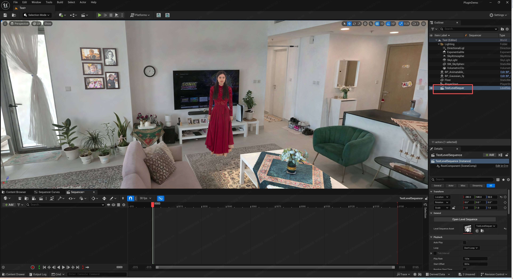

2.Add the selected Animation Gaussian Splatting Actor to the Sequencer.


3.Add the AnimSplattingComponent to the track.

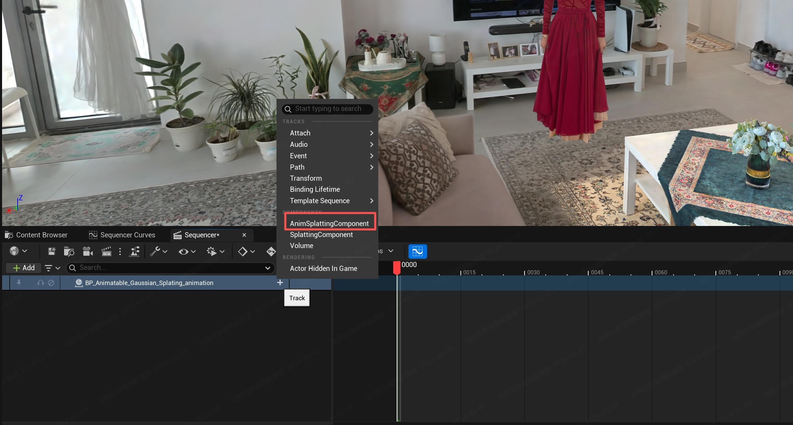

4.Add Frame Index to the track.

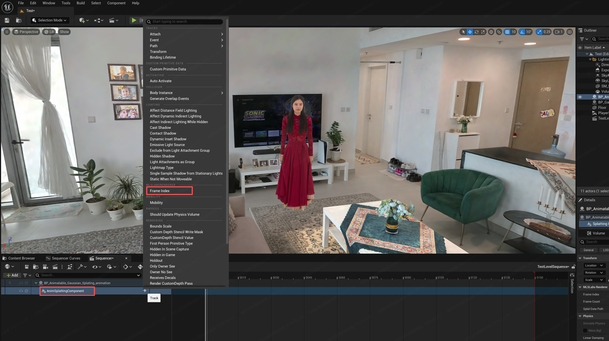

5.Add keyframes to the 'Frame Index' track as needed to control playback.

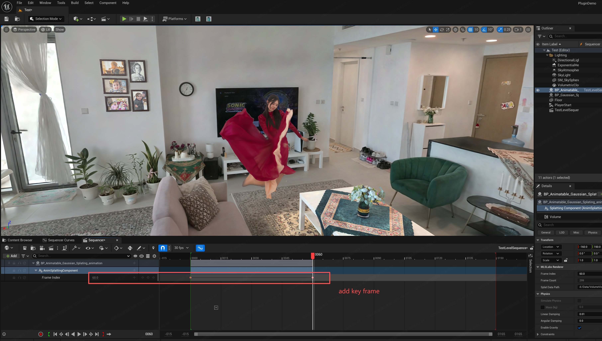

## Packaging for Windows

The plugin is currently provided as a Shipping package, so you must set your Build Configuration to Shipping.

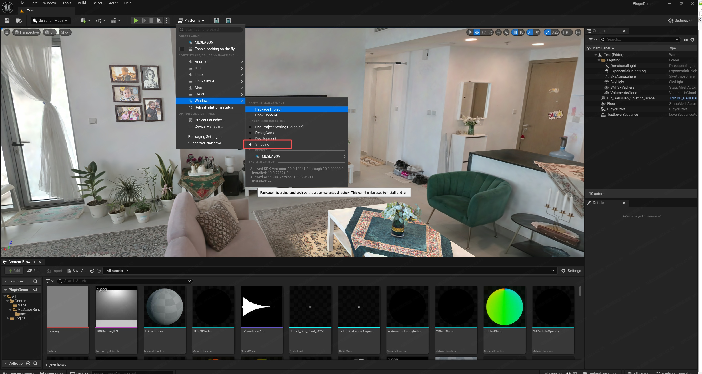

Important: After packaging, ensure the .ply files are stored in the same absolute data path on the target machine for the application to run correctly.
