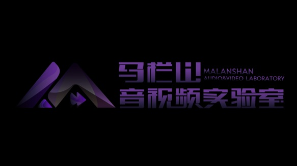

# MLSLabsRenderer-Lite

<a href="./LICENSE">
    </a>

English | [中文](./README_CN.md)

[
  
](https://github.com/mlslabs)

---

## Table of Contents

- [Introduction](#introduction)
- [Project Structure](#project-structure)
- [Features](#features)
- [Getting Started](#getting-started)
- [Roadmap (Pro Version)](#roadmap-pro-version)
- [Release Note](#release-note)
- [Contributors](#contributors)

---

## Introduction

**MLSLabsRenderer-Lite** is a high-performance Unreal Engine 5 (UE5) plugin developed by **MaLanShan Audio & Video Laboratory**. It is specifically designed for real-time visualization, management, and scalable hybrid rendering of 3D Gaussian Splatting (3DGS) and dynamic Volumetric Video (4DGS).

Unlike traditional particle-based systems, our custom rendering pipeline ensures high frame rates even with millions of Gaussians, bypassing Niagara's typical limitations.

---

## Project Structure

```text
📦 MLSLabsRenderer-Lite
├─ 📁 Source
│  ├─ 📁 MLSLabsRenderer           # Runtime rendering module
│  └─ 📁 MLSLabsRendererImporter    # Editor import & asset management
├─ 📁 ThirdParty
│  └─ 📁 Win64
│     └─ 📁 Bin                    # Core high-performance rendering DLL
├─ 📁 Content                      # Example assets, shaders, and media
├─ LICENSE                         # Apache-2.0 License
└─ README.md                       # Main overview file
### Features
- **High-Performance Static 3DGS: High-quality rendering of standard .ply models supporting up to 7M+ Gaussians at 50 FPS+.**

- **Dynamic 4DGS Playback: Real-time volumetric video sequence playback supporting 100K+ Gaussians at 100 FPS+.**

- **Sequencer Integration: Full support for UE Sequencer, allowing users to keyframe volumetric playback and control timelines.**

- **Custom Rendering Engine: Built from the ground up (Non-Niagara) for maximum throughput and low latency.**

- **Production Workflow: Seamless integration with native UE assets and fast resource importing.**
---
## Getting Started
### 1. Clone the Repository
```bash
git clone https://github.com/mlslabs/MLSLabsGaussianSplattingRenderer-UE.git
cd MLSLabsGaussianSplattingRenderer-UE
```
### 2. Requirements
Unreal Engine: 5.5

Platform: Windows (Win64)

###3. Installation
Copy the Plugins/MLSLabsRenderer folder to your project's Plugins/ directory.

Re-generate project files and rebuild your solution.

Enable MLSLabsRenderer in the Unreal Editor Plugin Browser.

###Roadmap (Pro Version)
The upcoming Professional version will offer significant performance boosts and enterprise-level features:

- [ ]VR & Binocular Rendering: Native support for high-fidelity VR content.

- [ ]Compressed 4DGS: Support for specialized compressed formats to reduce memory usage.

- [ ]Large-Scale Environments: Support for the .sog format for city-scale static 3DGS.

- [ ]Advanced Lighting: Support for Point/Directional lights with self-shadowing.

- [ ]Performance Boost: 120 FPS+ for 4DGS and 60 FPS+ for 7M+ static scenes.

## Release Note
[v1.0.0.6-beta]

Initial Public Beta release.

Added support for 4DGS .ply sequence playback.

Integrated Sequencer keyframe support for volumetric video.

Optimized static 3DGS rendering performance for 7M+ points.

Encapsulated core rendering logic into high-performance DLL.

##Contributors
MaLanShan Audio & Video Laboratory