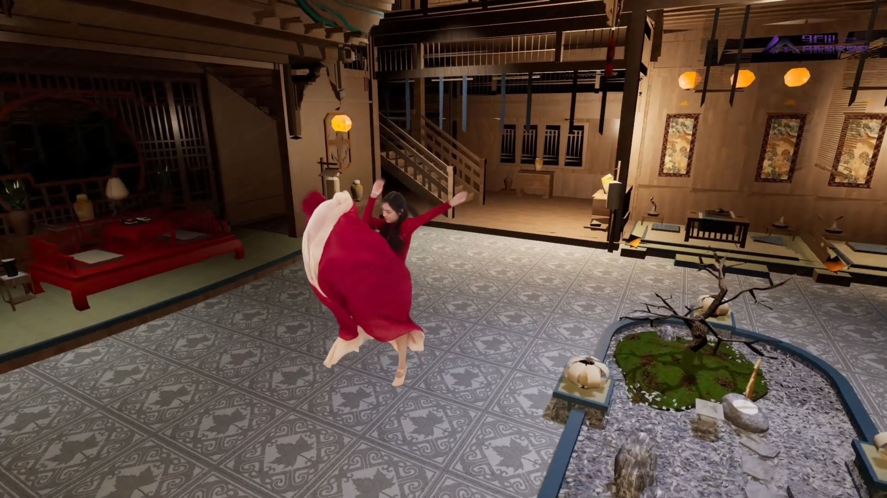
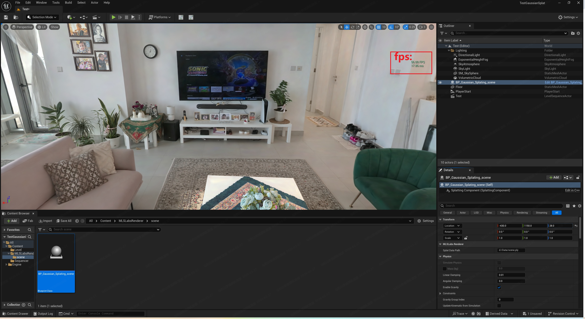

English | [中文](./README_CN.md)

<div align="center"><picture>
  
</picture></div>

<div align="center">

**3D Gaussian Splatting UE5 Plugin**

High-performance 3D Gaussian Splatting and 4D volumetric video Plugin for Unreal Engine 5.

Real-time visualization, Sequencer-driven playback, and a custom non-Niagara rendering pipeline for millions of Gaussians.

<p align="center">
  <a href="./LICENSE">
    
  </a>
  
  
  
  
</p>

[**Downloads**](https://github.com/mlslabs/MLSLabsGaussianSplattingRenderer-UE/releases) •
[**Getting Started**](#getting-started) •
[**Installation**](#installation) •
[**Docs**](https://github.com/mlslabs/MLSLabsGaussianSplattingRenderer-UE/blob/main/PluginDemo/README.md) •
[**Join Discord**](https://discord.com/channels/1485158006705623062/1485158007464788133) •
[**Contributors**](#contributors)



[**Application Cases**](#application-cases) •
[**Introduction**](#introduction) •
[**Features**](#features) •
[**Project Structure**](#project-structure) •
[**Roadmap**](#roadmap-pro-version) •
[**Release Notes**](#release-notes) •
[**License**](https://github.com/mlslabs/MLSLabsGaussianSplattingRenderer-UE/blob/main/LICENSE)

</div>

---

<a id="application-cases"></a>

## 3DGS & 4DGS Application Cases

- [4DGS Redefines VR Filmmaking](https://youtu.be/wN7Sm6GbV7U)

---

## Introduction

**MLSLabsRenderer-Lite** is a high-performance Unreal Engine 5 (UE5) plugin developed by [**MaLanShan Audio & Video Laboratory**](https://www.mlslabs.com.cn/). It is engineered for real-time visualization, management, and scalable hybrid rendering of 3D Gaussian Splatting (3DGS) and dynamic Volumetric Video (4DGS).

By utilizing a custom rendering pipeline rather than traditional particle systems, the plugin ensures high frame rates even with millions of Gaussians, effectively bypassing the performance bottlenecks typical of Niagara.

---

## Project Structure

```text
📦 MLSLabsGaussianSplattingRenderer-UE
├─ 📁 PluginDemo
│  ├─ Config/                # Plugin configuration presets
│  ├─ Content/               # Example assets
│  │  └─ Maps/               # Map assets
│  ├─ Media/                 # Documentation images and videos
│  ├─ Plugin/                # Plugin source code
│  ├─ README.md              # English plugin guide
│  └─ README_CN.md           # 中文插件指南
├─ LICENSE
├─ README.md                 # Main overview file
└─ README_CN.md              # 中文概述
```

## PluginDemo

The `PluginDemo` folder contains all UE5 plugin assets, source code, and documentation.

**Quick Links:**

- [Plugin Guide (EN)](./PluginDemo/README.md)
- [插件指南 (中文)](./PluginDemo/README_CN.md)

### Features

- **High-Performance Static 3DGS: High-quality rendering of standard .ply models supporting up to 7M+ Gaussians at 50 FPS+(tested on NVIDIA RTX 4070 Ti).**



- **Dynamic 4DGS Playback: Real-time volumetric video sequence playback supporting 100K+ Gaussians at 100 FPS+.(tested on NVIDIA RTX 4070 Ti)**

- **Sequencer Integration: Full support for UE Sequencer, allowing users to keyframe volumetric playback and control timelines.**

- **Custom Rendering Engine: Built from the ground up (Non-Niagara) for maximum throughput and low latency.**

- **Production Workflow: Seamless integration with native UE assets and fast resource importing.**

---

## Getting Started

### 1. Clone the Repository

```bash
git clone https://github.com/mlslabs/MLSLabsGaussianSplattingRenderer-UE.git
cd MLSLabsGaussianSplattingRenderer-UE
```

### 2. Requirements

- **Operating System**: Windows 10 or 11 (64-bit)
- **Unreal Engine**: 5.5.x
- **Graphics API**: DirectX 12
- **GPU Requirements**: NVIDIA GPU supporting **Shader Model 7.5** or higher (Turing architecture and above).
- **Minimum Hardware**: NVIDIA GeForce **RTX 2060** or better.
- **Recommended Hardware**: NVIDIA GeForce **RTX 4070Ti** or better.

<a id="installation"></a>

### 3. Installation

Download the MLSLabsRenderer plugin from the link specified in ./PluginDemo/Plugins/download.txt.

Copy the Plugins/MLSLabsRenderer folder to your project's Plugins/ directory.

For Packaging: To ensure successful project packaging, copy the MLSLabsRenderer folder to your UE5.5 Engine directory (e.g., Epic Games\UE_5.5\Engine\Plugins\Marketplace).

Enable MLSLabsRenderer in the Unreal Editor Plugin Browser.

### Roadmap (Pro Version)

The upcoming Professional version will offer significant performance boosts and enterprise-level features:

- [ ] VR & Binocular Rendering: Native support for high-fidelity VR content.

- [ ] Compressed 4DGS: Support for specialized compressed formats to reduce memory usage.

- [ ] Large-Scale Environments: Support for the .sog format for city-scale static 3DGS.

- [ ] Advanced Lighting: Support for Point/Directional lights with self-shadowing.

- [ ] Performance Boost: 120 FPS+ for 4DGS and 60 FPS+ for 7M+ Gaussians static scenes.

## Release Notes

[v1.0.0.5-beta]

1.Standard PLY Support (Static): Supports importing standard .ply format static Gaussian Splatting scenes with high-efficiency rendering.

2.Volumetric Video (4DGS): Supports importing standard .ply sequence frames for volumetric video (4DGS) with high-efficiency rendering.

3.Quick Focus: Press the F key to quickly focus on and frame the Gaussian Actor in the viewport.

4.Sequencer Integration: Volumetric Video Actors support keyframe animation and timeline control within the Unreal Engine Sequencer.

5.DirectX 12: Full support for DX12 (DirectX 12) for modern rendering performance.

6.Shipping Support: Supports application packaging and distribution for Shipping builds.

## Contributors

<a href="https://github.com/mlslabs/MLSLabsGaussianSplattingRenderer-UE/graphs/contributors">
  
</a>
