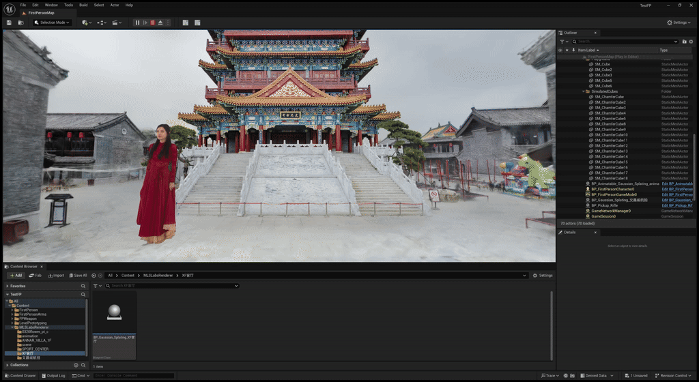
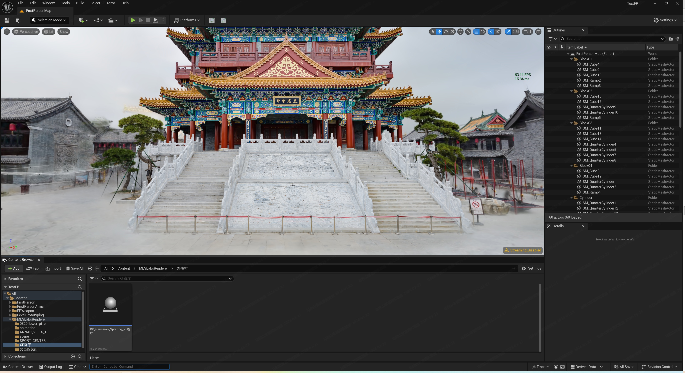

[English](./README.md) | 中文

<div align="center">
  <a href="https://mlslabs.com.cn/">
    <picture>
      
    </picture>
  </a>
</div>

<div align="center">

**MLSLabsRenderer-Lite (3D Gaussian Splatting UE5 Plugin)**

面向虚幻引擎 5 的高性能 3D 高斯泼溅与 4D 体积视频插件。

实时可视化、Sequencer 驱动播放，以及可支撑数百万高斯点的自定义非 Niagara 渲染管线。

<p align="center">
  <a href="./LICENSE">
    
  </a>
  
  
  
  
</p>

[**下载 (Releases)**](https://github.com/mlslabs/MLSLabsGaussianSplattingRenderer-UE/releases) •
[**入门指南**](#入门指南) •
[**安装**](#installation) •
[**文档**](https://github.com/mlslabs/MLSLabsGaussianSplattingRenderer-UE/blob/main/docs/README.md) •
[**加入 Discord**](https://discord.com/channels/1485158006705623062/1485158007464788133) •
[**贡献者**](#贡献者)



[**应用案例**](#application-cases) •
[**简介**](#简介) •
[**功能特性**](#核心特性) •
[**项目结构**](#项目结构) •
[**路线图**](#路线图-专业版) •
[**专业版**](https://github.com/mlslabs/MLSLabsGaussianSplattingRenderer-UE/tree/ue5.6-plugin-pro) •
[**版本记录**](#版本记录)

</div>

---

<a id="application-cases"></a>

## 3DGS & 4DGS 应用案例

- [4DGS重新定义VR电影拍摄](https://www.bilibili.com/video/BV13hFmzqE3h/?vd_source=2c7de8ebd046c0fc280b916fd7f72364)

---

## 简介

**MLSLabsRenderer-Lite** 是由 [**马栏山音视频实验室**](https://www.mlslabs.com.cn/) 开发的一款高性能虚幻引擎 5 (UE5) 插件。该插件专为 3D 高斯泼溅 (3DGS) 和动态体积视频 (4DGS) 的实时可视化、管理以及可扩展混合渲染而设计。

通过采用自定义渲染管线而非传统的粒子系统，该插件确保了在处理数百万个高斯点时仍能保持高帧率，有效地解决了 Niagara 系统中常见的性能瓶颈。

---

## 项目结构

```text
📦 MLSLabsGaussianSplattingRenderer-UE
├─ 📁 docs/                  # 插件指南（中英文）
├─ 📁 Media/                 # 文档图片与视频
├─ 📁 Plugins/               # MLSLabsRenderer 插件源码
├─ 📁 TestData/              #Test Data
    ├─ 📁 ply/               #ply Data
	    ├─ data_download_link.md               # 测试数据下载链接
├─ LICENSE
├─ README.md                 # 主概述文件（英文）
└─ README_CN.md              # 主概述文件（中文）
```

## 仓库结构

`Plugins` 文件夹包含 MLSLabsRenderer 插件源代码，`docs` 文件夹包含详细的插件使用指南。

**快速链接：**

- [插件指南 (英文)](./docs/README.md)
- [插件指南 (中文)](./docs/README_CN.md)

### 核心特性

- **高性能静态 3DGS： 支持标准 `.ply` 模型的高质量渲染，在 5M+ 高斯点数下仍可保持 50 FPS+ 的帧率（在NVIDIA RTX 4070Ti上测试）。**



- **动态 4DGS 播放： 支持实时体积视频序列播放，在 100K+ 高斯点数下支持 100 FPS+（在NVIDIA RTX 4070Ti上测试）。**
- **Sequencer 集成：全面支持 UE 定时器（Sequencer），允许用户通过关键帧控制体积视频播放及其时间轴。**
- **自定义渲染引擎：纯原生开发（非 Niagara），旨在实现最大吞吐量和极低延迟。**
- **生产级工作流：与 UE 原生资源无缝集成，支持资源的快速导入。**

---

## 入门指南

### 1. 克隆仓库

使用 Git 客户端将本仓库克隆到本地。

```bash
git clone https://github.com/mlslabs/MLSLabsGaussianSplattingRenderer-UE.git
cd MLSLabsGaussianSplattingRenderer-UE
```

### 2. 环境要求

- **操作系统**: Windows 10 或 11 (64位)
- **虚幻引擎版本**: 5.6.x
- **图形 API**: DirectX 12
- **显卡要求**: 必须使用支持 **SM 7.5 (Shader Model 7.5)** 指令集及以上的英伟达 (NVIDIA) 显卡。
- **最低硬件**: NVIDIA GeForce RTX 2060 或更高。
- **推荐硬件**: NVIDIA GeForce RTX 4070 Ti或更高。

<a id="installation"></a>

### 3. 安装步骤

1. 将 `Plugins/MLSLabsRenderer` 文件夹复制到你项目的 `Plugins/` 目录下。
2. **关于项目打包：** 为确保项目顺利打包，请将 `MLSLabsRenderer` 文件夹复制到 UE5.6 引擎安装目录中（例如：`Epic Games\UE_5.6\Engine\Plugins\Marketplace`）。
3. 在虚幻引擎编辑器的“插件浏览器”中启用 **MLSLabsRenderer**。

---

## 路线图 (专业版)

即将推出的专业版将提供显著的性能提升和企业级功能：

- [ ] **VR 与双目渲染：** 原生支持高保真 VR 内容。
- [ ] **压缩版 4DGS：** 支持专用的压缩格式以大幅降低显存占用。
- [ ] **大规模场景：** 支持用于城市级静态 3DGS 的 `.sog` 格式。
- [ ] **高级光照：** 支持点光源/方向光，并具备自阴影效果。
- [ ] **性能飞跃：** 4DGS 达到 120 FPS+，5M+高斯点 静态场景达到 60 FPS+。

---

## 版本记录

**Pro_V1.0.1.10_beta**
1. 性能提升：4DGS 场景帧率达 120 FPS 以上，700 万以上高斯点静态场景帧率达 60 FPS 以上。
2. VR 与双目渲染：原生支持高保真 VR 内容。
3. 修复缩放高斯泼溅节点上颜色显示异常的问题。
4. 解决打包过程中删除库文件（如 cublas64_12.dll）时出现的 “访问被拒绝” 错误。
5. 新增 Logo 水印功能；注：暂不支持付费去除水印。
6. 修复高斯角色在同时执行俯仰、偏航和滚转操作时旋转错误的问题。
7. 新增多显卡系统下对非主显卡（显卡 ID＞0）渲染的支持。

**Lite_V1.0.0.9_beta**
1. 修复编辑器模式与运行模式下因深度缓冲分辨率不匹配导致的混合瑕疵问题。
2. 支持将日志输出至虚幻引擎日志文件。

**Lite_V1.0.0.8_beta**
1. 支持 sh_degree=0 的 PLY 文件。
2. 修复新增相机进入预览模式时出现的帧率大幅下降及内存耗尽问题。

**Lite_V1.0.0.7_beta**
1. 解耦 LibTorch 库，首次使用插件时提示用户手动下载。
2. 支持虚幻引擎 5.5、5.6、5.7 版本。

**Lite_V1.0.0.6_beta**
1. 修复反复拖拽更新高斯 Actor 变换会导致引擎崩溃的问题。

**Lite_V1.0.0.5_beta**
1. 标准 PLY 格式支持（静态）：支持导入标准 .ply 格式静态高斯泼溅场景并高效渲染。
2. 体积视频（4DGS）：支持导入标准 .ply 序列帧实现体积视频（4DGS）高效渲染。
3. 快速聚焦：按下 F 键可在视口中快速聚焦并框选高斯 Actor。
4. 序列器集成：体积视频 Actor 支持在虚幻引擎序列器中进行关键帧动画与时间轴控制。
5. DirectX 12：全面支持 DX12（DirectX 12），保障现代渲染性能。
6. 发布版支持：支持应用打包与发布版分发。

---

## 贡献者

<a href="https://github.com/mlslabs/MLSLabsGaussianSplattingRenderer-UE/graphs/contributors">
  
</a>
